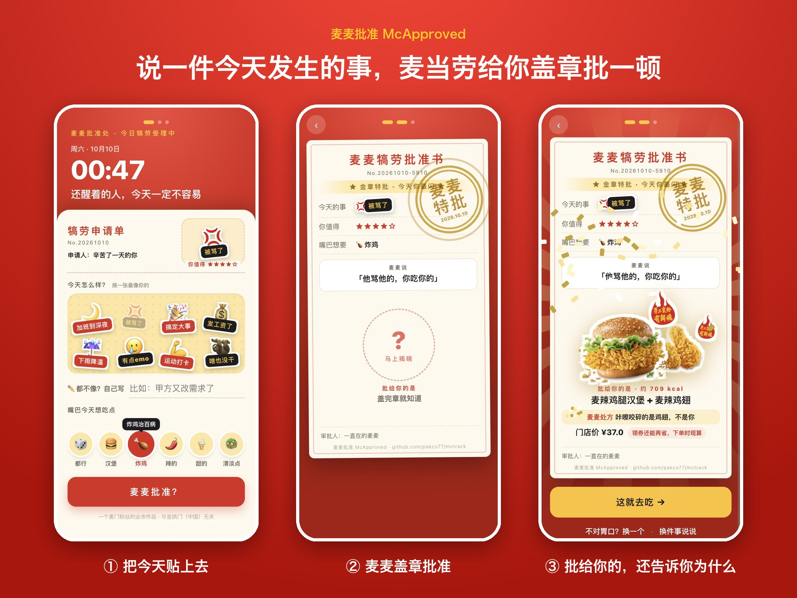
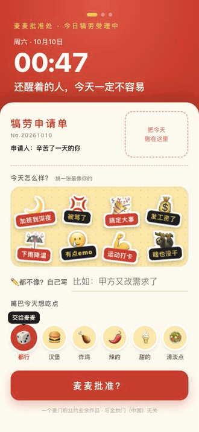

# 麦麦批准 McApproved

> 说一件今天发生的事，麦当劳给你盖章批一顿。

**👉 [在线试玩（手机打开更好玩）](https://pakco77.github.io/mctrack/app/)**　·　[English](https://pakco77.github.io/mctrack/app/?lang=en)　·　觉得好玩，右上角点个 ⭐ Star

> 中英双语，自动跟随手机系统语言。

<p align="center"></p>

## 为什么做这个

人想吃麦当劳，多半不是因为饿，是想给今天一个交代。缺的只是一个理由，和一点不心疼。

麦麦批准把这件事做完整：**说中你的今天 → 盖章批准 → 券后价算好 → 想吃就一键下单**。

## 玩法

<p align="center"></p>

1. 开屏按此刻时间打招呼，递上一张「犒劳申请单」
2. 挑一张事由贴纸（或自己写一句）+ 点一个「想吃点」徽章 → 提交
3. 审批意见逐字打出 → 大红章砸下 → 批准的食物从「?」里蹦出来（约 1/6 出**金章特批**，同一天同事由结果固定）
4. 不爱吃就「换一个」；一键存图发群；领券去吃（WorkBuddy 版显示真实券后价）

## 匹配规则：发生的事 → 情绪需求 → 食物功效

| 今天的事 | 需要 | 批给你 | 麦麦处方 |
|---|---|---|---|
| 被骂了 | 发泄 | 麦辣鸡腿汉堡 + 麦辣鸡翅 | 咔嚓咬碎的是鸡翅，不是你 |
| 有点 emo | 安慰 | 薯条 + 麦旋风 | 薯条蘸麦旋风，甜咸一口，心情回来一半 |
| 搞定一件大事 | 庆祝 | 麦辣鸡翅 + 可乐 | 举杯的那只手，得拿着鸡翅 |
| 发工资了 | 犒赏 | 巨无霸 + 薯条 | 今天就点最大的那个，两层牛肉都是你的 |
| 加班到深夜 | 补能 | 麦辣鸡腿汉堡 + 薯条 | 一整块鸡腿，熬掉的力气补回来 |
| 下雨降温 | 取暖 | 麦香鸡 + 鲜萃咖啡 | 热乎乎软绵绵，捧在手里就安心 |
| 运动打卡了 | 恢复 | 板烧鸡腿堡 + 苹果汁 | 扎实的鸡腿肉，蛋白质到账 |
| 啥也没干 | 小确幸 | 圆筒冰淇淋 | 啥也没干也值得一个甜筒，但只有一个 |

- 口味（汉堡/炸鸡/辣的/甜的/清淡点）是过滤器，对症是排序；份量看犒劳指数 1～4 星（约 93～774 kcal），犒劳讲刚好，不是越惨吃越多
- WorkBuddy 版还会查你的历史订单，同档位里优先批你真正常点的（"你点过 N 次"）

## 安装

### 方式一：WorkBuddy Skill（完整体验：真实菜单、真领券、真下单）

1. 申请麦当劳 MCP Token：[open.mcd.cn/mcp](https://open.mcd.cn/mcp)（手机号登录 → 控制台 → 激活）
2. WorkBuddy【连接器】→【自定义连接器】→【配置MCP】，粘贴 `mcp-config.example.json` 内容并替换 `YOUR_MCP_TOKEN`
3. 将本仓库 `SKILL.md` + `app/` 安装为 WorkBuddy 技能，启用 mcd-mcp 连接器
4. 对 WorkBuddy 说：「批我一顿，今天被甲方改了第八版」

### 方式二：纯 H5（无需 Token）

打开 [在线试玩](https://pakco77.github.io/mctrack/app/)，或直接打开本地 `app/index.html`。使用内置菜单快照，价格为门店价，不领券。

## 目标用户

- 打工人和学生：需要一个理由犒劳自己，又怕花多、吃多
- 选择困难的麦当劳常客：不想翻菜单，要一个"刚好"的答案
- 想用 MCP 做情绪类场景的开发者（本仓库即参考实现）

## 项目结构

```
├── SKILL.md                 # WorkBuddy Skill 定义（触发词、事件表、MCP 调用流程、注入格式）
├── app/index.html           # 批准书 H5（单文件，零依赖）
├── assets/                  # README 用的截图与盖章动图
├── MCP_INTEGRATION.md       # MCP 接入说明
├── CONTEST_DECLARATION.md   # 参赛声明（官方文件，未改动）
├── mcp-config.example.json  # 脱敏 MCP 配置模板
└── workbuddy.md             # WorkBuddy 开发对话上下文
```

## 技术说明

- **单文件 H5，零依赖**：印章砸下、放射光、彩纸、烟花全部纯 CSS；食物白边贴纸用多层投影沿透明抠图描边；音效全部 Web Audio 合成；批准书可一键存图（canvas 重绘）
- **真实数据**：菜单与价格来自 MCP `query-meals`，热量来自 `list-nutrition-foods`，图片走麦当劳官方 CDN
- **兜底**：菜单图加载卡住 2.5 秒自动换插画；MCP 不可用时用快照并标「门店价」
- **隐私**：Token 只存本机 MCP 配置，不进仓库与页面；历史订单只用于挑餐，不写进分享物

## 版本

v3.5 批准书一键存图。v3.4 对症匹配 + 麦麦处方。v3.3 中英双语。v3.0 由早期作品「麦反应」重新定位为「麦麦批准」（更早版本见 workbuddy.md）。

## 免责声明

本项目为麦当劳程序员节创意开发大赛参赛作品，系独立开发的非官方粉丝作品，与金拱门（中国）无关。餐品信息、价格及供应状态以麦当劳官方渠道实时结果为准；批准书内容仅供娱乐。
